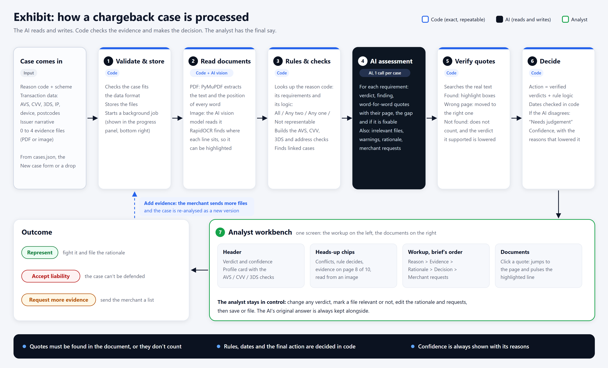
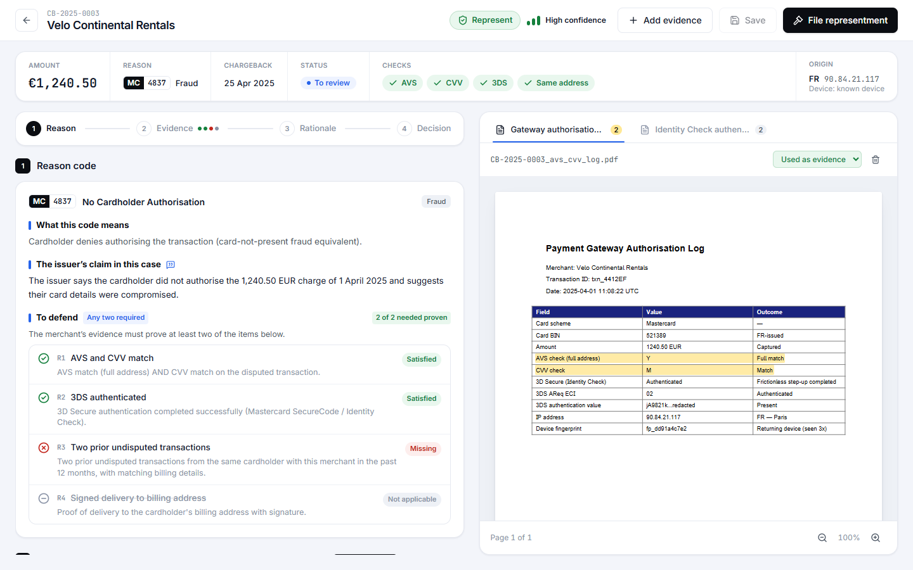

# Exhibit

A workbench for chargeback analysts. Give it a case (reason code, transaction data, issuer narrative and the merchant's evidence files) and it returns an analyst-ready representment workup: what the issuer is alleging, whether each compelling-evidence requirement is met, a draft rationale and a recommended action. Every finding points at the exact line in the merchant's documents, highlighted in place, so the analyst can check it in seconds instead of opening four PDFs.

**Live demo: https://exhibit-disputes.fly.dev**. Browse the 10 provided cases, or upload a new one to watch a live analysis.
**Walkthrough with screenshots:** [WALKTHROUGH.md](WALKTHROUGH.md)



## Run it (under 10 minutes)

The 10 provided cases ship with their analysis already generated (`seed/`), so everything can be browsed without an API key. A key is only needed to analyse new cases or re-analyse after adding evidence.

**With Docker**

```bash
git clone https://github.com/yuktae/CaseStudy_Checkout_Yukta.git
cd CaseStudy_Checkout_Yukta
cp .env.example .env          # add ANTHROPIC_API_KEY to run new analyses
docker compose up --build
```

Open http://localhost:8080. The first build takes a few minutes because of the OCR runtime.

**Without Docker** (Python 3.12, Node 20+)

```bash
python -m venv .venv
.venv/bin/pip install -r backend/requirements.txt
.venv/bin/python -m uvicorn app.main:app --app-dir backend --port 8000
# in a second terminal
cd frontend && npm ci && npm run dev
```

Open http://localhost:5173. On Windows use `.venv\Scripts\` instead of `.venv/bin/`.

**From the command line**

```bash
cd backend
../.venv/bin/python -m app.cli run --all   # analyse every case and refresh seed/
../.venv/bin/python -m app.cli eval        # compare the actions with eval/expected.json
../.venv/bin/python -m pytest tests -q     # tests, no API key needed
```

## How a case flows through the code

The split is deliberate: the LLM does the reading and the writing, and plain code does everything that has to be exact (rules, dates, counting, checking quotes, the final decision). The backend lives in `backend/app/`.

1. **Intake** (`main.py`, `pipeline.py`). The case is validated against the `cases.json` schema, the files are stored and a background job starts. Its progress shows in a small panel in the UI.
2. **Reading the documents** (`documents.py`, `vision.py`). PDFs go through PyMuPDF, which gives the text and the position of every word. Images are read by a vision model, and RapidOCR finds where each line sits so it can be highlighted.
3. **Rules and checks** (`rules.yaml`, `rules.py`). `reason_codes.md` is encoded as data: each code's requirements and whether it needs all of them, any two, any one, or can't be represented at all (Visa 10.5, Mastercard 4870). This step also builds the AVS, CVV, 3DS and address checks, and finds linked cases that share a device, IP or postcode.
4. **Assessment** (`assess.py`). One structured LLM call per case. For each requirement it returns a verdict, a finding, verbatim quotes with their page, the gap and whether the merchant could fix it. It also marks irrelevant documents, flags conflicts, and drafts the rationale, justification and merchant requests. Merchant documents are passed as untrusted data: their text can't open or close the prompt's own sections, and the prompt tells the model to flag, not follow, any instructions found inside them.
5. **Checking every quote** (`locate.py`). Each quote is searched for in the extracted text (exact first, then fuzzy) and turned into highlight boxes. A quote on the wrong page is moved to the right one. A quote that can't be found doesn't count as evidence and lowers the verdict it supported.
6. **The decision** (`decide.py`). The recommended action comes from the verified verdicts and the rule logic, not from the model. Delivery dates are checked against the chargeback date, using only dates whose quote was found in the documents. If the model's own recommendation disagrees, the case is flagged "Needs judgement" and a short second call rewrites the rationale so the text to file argues for the final action. Confidence always comes with the reasons that lowered it.

The frontend (`frontend/src`, React + TypeScript) has two pages: the dashboard (`pages/dashboard`) and the case analysis (`pages/analysis`).

## What the analyst sees


**Dashboard.** The case queue, sorted easiest first so clean cases can be cleared quickly. Each card answers the triage questions: who, how much, which rule, what the tool recommends, how sure it is, and whether something needs a look. Tabs follow the case lifecycle, and filters and search are kept in the URL.



**Case analysis.** The verdict and the transaction checks sit at the top. Anything easy to miss (a conflict, a rule that forces the outcome, evidence on page 8 of 10) shows as a heads-up chip. The workup follows the brief's order: reason code summary with a "to defend" checklist, evidence assessment, rationale, recommended action and merchant requests. The documents are on the right, and clicking a quote jumps to the highlighted line.

**What the analyst can override:** any verdict (with a note), whether a document counts as evidence, the recommended action (a reason is required), the justification, the rationale and the merchant requests. The AI's version is kept next to the analyst's. "Add evidence" uploads more files and re-analyses the case as a new version.

## Reading the documents: the tradeoff

- Text extraction alone is fast and exact, but it can't see images. In case 0002 the only proof of delivery is a screenshot.
- Tesseract OCR needs a system install, which works against "runnable in 10 minutes", and it reads characters without understanding them ("front view only", "left in safe place").
- A vision model understands images well but can't say where on the page a line is, which highlighting needs.

So it's a mix: PyMuPDF for PDF text and positions, a vision model to read images, and RapidOCR (a pip install, no system dependencies) to locate their lines. Each quote in the UI shows where it came from: verified in the document, read from an image, or not found.

## Surfacing uncertainty

- Quotes that can't be found in the documents are struck through and don't count.
- "Needs judgement" appears when the rule check and the model disagree; both views are shown and the rationale is rewritten for the final action.
- Confidence is shown with its reasons, for example "key evidence read from an image".
- "Not relevant" is kept separate from "missing", so a merchant's own fraud score shows as uploaded but irrelevant, with the reason.
- Heads-up chips cover what's easy to miss: conflicts, deep pages, rules that decide the outcome, linked cases.
- Every partial or missing requirement ends with what's missing and how to fix it, or why it can't be fixed.

**How confidence is calculated** (`decide.py`, `score_confidence`). Confidence is about the recommended action. It starts at High and each failed check lowers it one level (none failed: High, one: Medium, two or more: Low):

1. Key evidence comes from document text, not only from an image.
2. Images the evidence relies on are fully legible (the vision model rates each one).
3. Every quoted passage was found in the documents.
4. No conflict in the evidence. A conflict doesn't count when accepting, because a merchant claim that the data contradicts can only support accepting.
5. The rule check and the AI recommendation agree.
6. When accepting a case that could be represented, no requirement is partly met (otherwise it may be closer than it looks).

Data inconsistencies, such as a time-zone difference, are shown as notes but don't change the level. Hovering the confidence label on a case shows the reasons.

## Configuration

Set in `.env` (see `.env.example`):

| Variable | What it does |
|---|---|
| `ANTHROPIC_API_KEY` | Needed for new analyses and re-analysis |
| `MODEL`, `ASSESS_EFFORT`, `VISION_EFFORT` | Model and reasoning effort for the two LLM calls |
| `DEMO_ACCESS_CODE` | If set, uploads and re-analysis ask for this code |
| `SEED_ON_START` | Load `data/` and `seed/` on first start |
| `MAX_FILES`, `MAX_FILE_MB` | Upload limits |

`data/` is the challenge dataset exactly as provided. To use another one, replace `data/` (same layout), delete `storage/` and run `app.cli run --all`. Nothing in the code is specific to these 10 cases. A `fly.toml` is included; the live demo runs on fly.io.

## Limitations and next steps

- The rules are the simplified ones from the exercise, with no time limits, thresholds or exclusions.
- Confidence is a transparent heuristic, not a calibrated probability. Overrides are stored next to the AI's answers, so the next step is to measure where analysts disagree, by reason code, and tune from that.
- One assessment call per case is fine at this size. Much larger evidence packs would need a retrieval step first.
- Image highlights depend on OCR finding the line; when it can't, the highlight is placed approximately and the quote says so.
- SQLite on one volume is fine for a demo. Production would need Postgres, object storage, authentication and per-analyst audit trails.
- Next features: pre-filling a new case from its documents, and an insights page (override rate by reason code, time per case).
