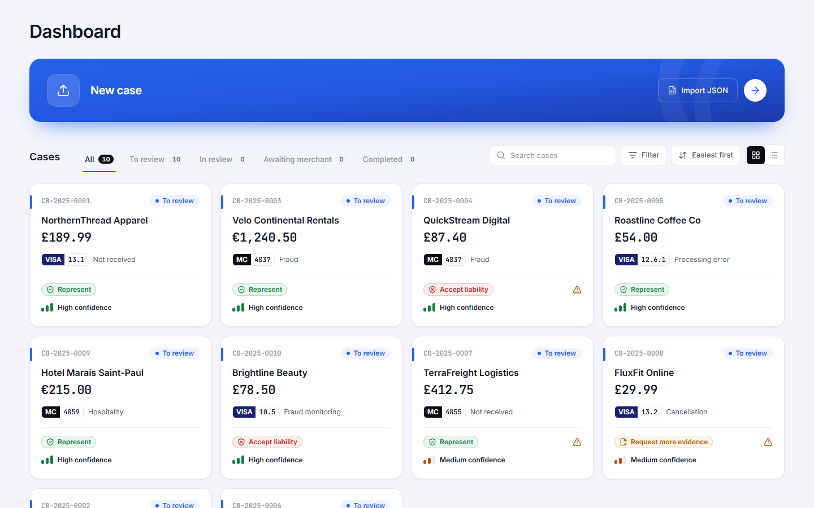
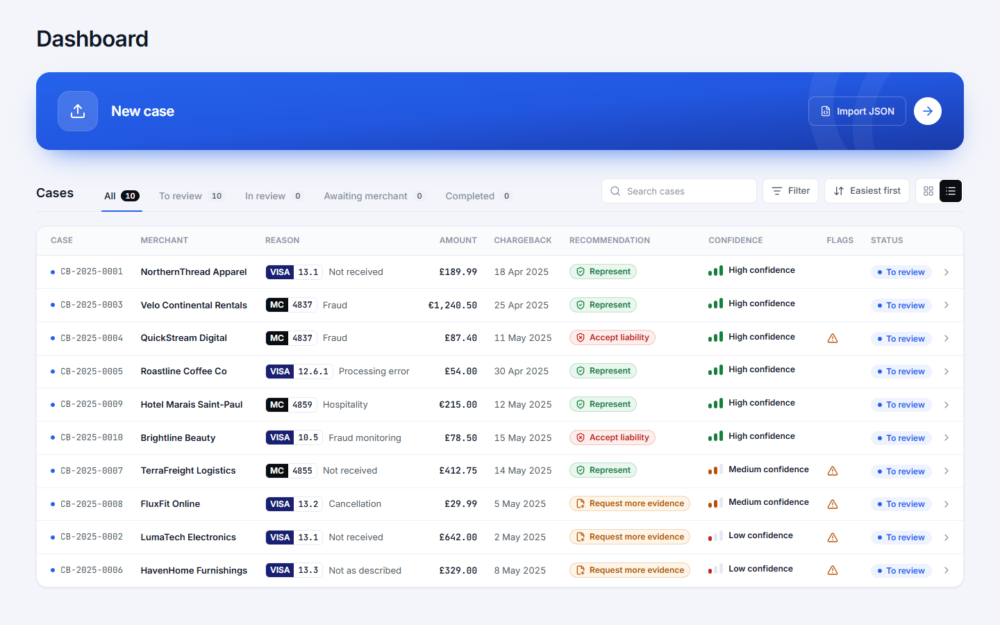
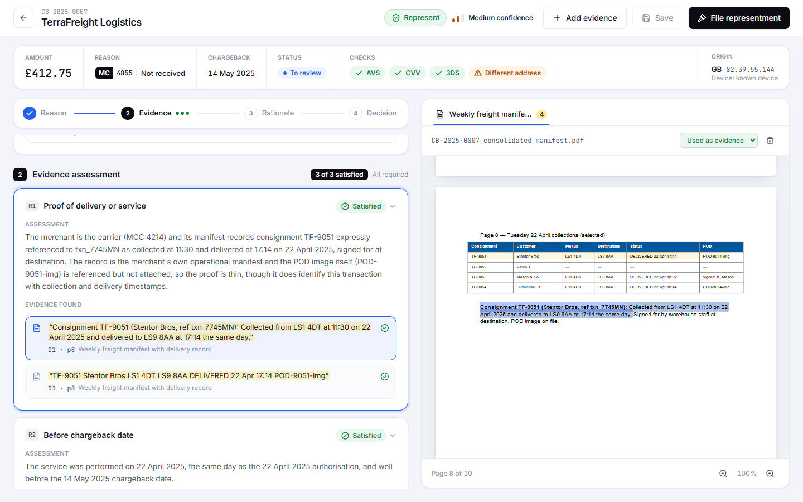
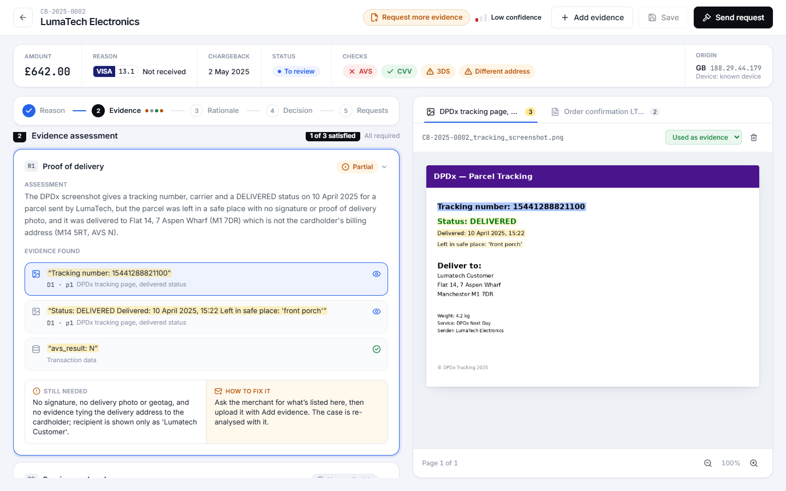
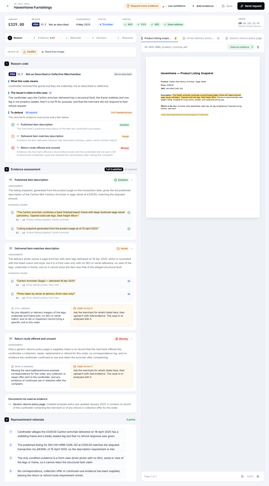
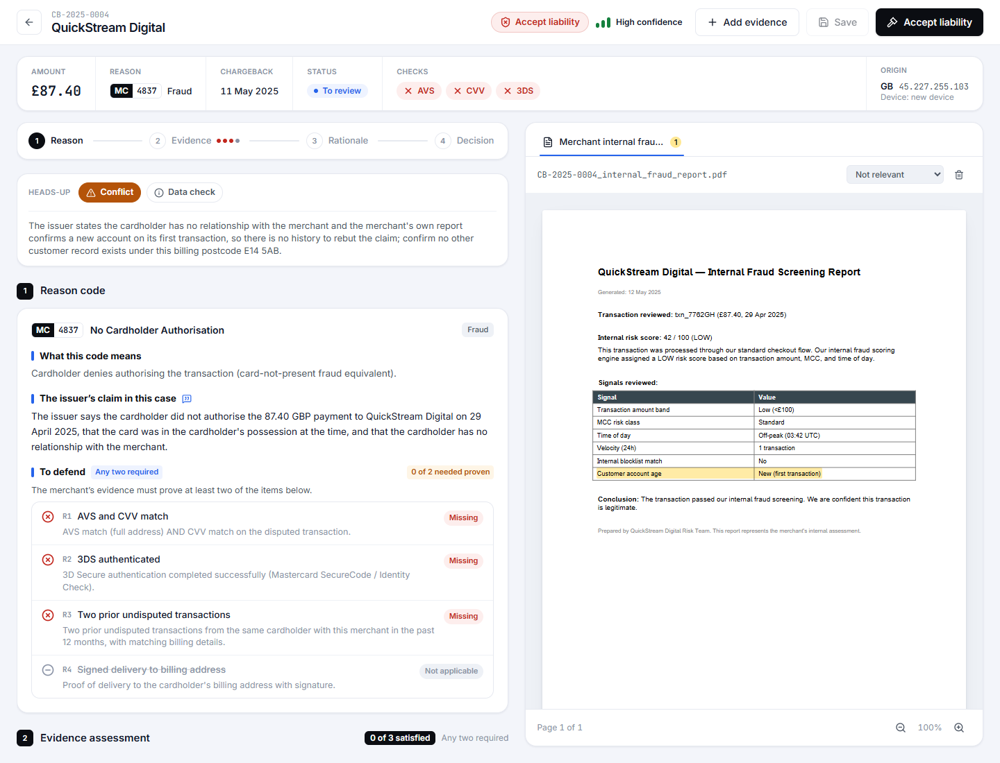
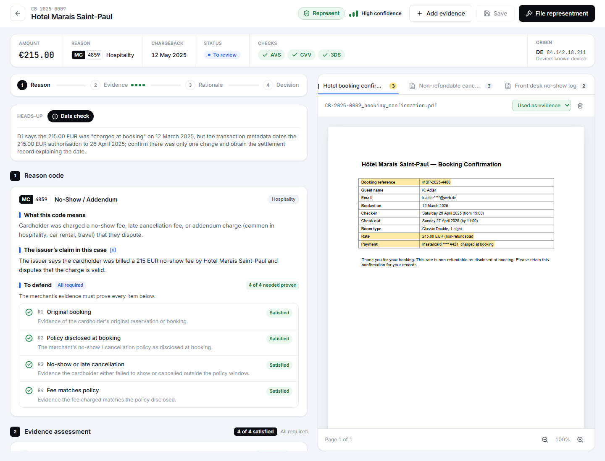
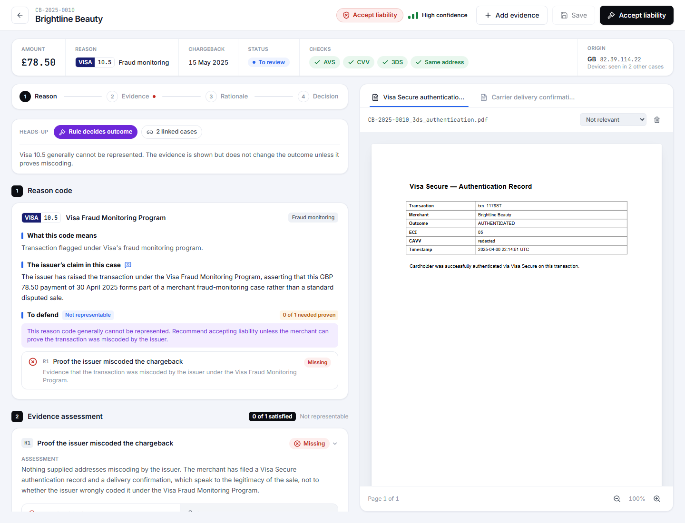
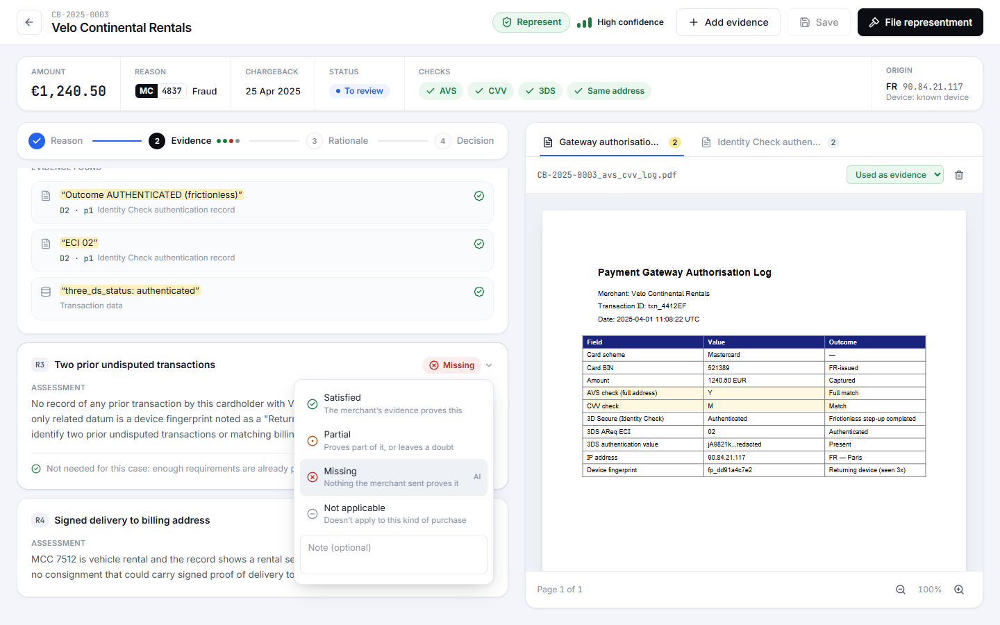
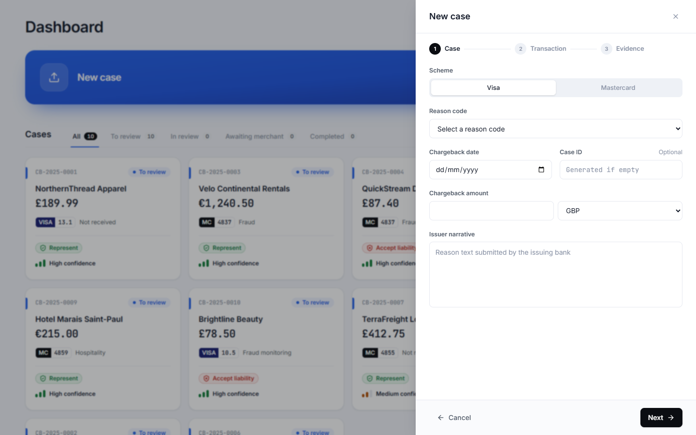

# Exhibit walkthrough

A tour of an analyst's session: triage, open a case, check the evidence, override, file, then bring in a new case. Screenshots are from a clean start with the 10 provided cases.

---

## 1. Triage the queue

- **New case** sits on top: drop evidence files or a case JSON on it, or click anywhere on it to open the form. **Import JSON** takes a case in the `cases.json` format.
- **Cases** below, sorted **Easiest first** by default: high-confidence cases come first so they can be cleared quickly, and the ambiguous ones are left for when the analyst has attention to spare.
- Each card answers the triage questions at a glance: who, how much, which rule, what the tool recommends and how sure it is. A warning icon means there's something to look at before deciding.
- Tabs follow the case lifecycle (**To review, In review, Awaiting merchant, Completed**). Filters cover scheme, category, recommendation, confidence and flags. Everything is kept in the URL, so coming back from a case restores the same view.

The list view shows the same information densely, for scanning a long queue.

---

## 2. Open a case: the rule, the evidence, the gap

Case **CB-2025-0007** is the "buried evidence" case. The merchant uploaded a 10-page manifest: pages 1 to 7 repeat the same filler table, pages 9 and 10 are empty, and the proof is one line on **page 8**.

- The header gives the verdict and the confidence. The profile card underneath shows the amount, the reason code, the chargeback date and the transaction checks (AVS, CVV, 3DS, addresses, device) without opening anything.
- The step bar (Reason, Evidence, Rationale, Decision) follows the sections as you scroll and jumps between them.
- The **evidence assessment** has one card per scheme requirement, with the verdict, the finding and the exact quotes that support it.
- **Clicking a quote** opens the document, scrolls to page 8 and pulses the highlight on the exact line. The quote was matched on the transaction reference `txn_7745MN`, not on the route, because other rows on the same page share the same postcodes.

---

## 3. Evidence inside images

Case **CB-2025-0002**: the only proof of delivery is a screenshot.

- The vision model reads the screenshot and OCR finds each line so it can be highlighted. The eye icon on a quote means it came from an image.
- The verdict is **Partial**: the parcel was "left in safe place: front porch", with no signature, at an address the cardholder says isn't theirs. The billing and shipping postcodes differ and AVS failed. The gap is **Fixable**, so the recommendation is to request more evidence with a specific list (prior orders to that address, login and IP records, carrier photo or GPS).
- Confidence is **Low**, and the reasons are stated: key evidence from an image, and evidence that conflicts with the claim.

---

## 4. The full workup, in the brief's order

Case **CB-2025-0006** (armchair "not as described"):

1. **Reason code**: what the code means, the issuer's claim in this case (the issuer's original words on hover), and a "To defend" checklist. The checklist says how many items the merchant must prove and counts how many are proven.
2. **Evidence assessment**: R1 satisfied (the listing); R2 partial (a front-view photo can't show a wobbling frame); R3 missing (the returns policy describes a route, but nothing shows what happened to the cardholder's request). Each card shows the assessment and the evidence found; partial or missing ones end with what's missing and how to fix it (or why it can't be fixed).
3. **Representment rationale**: numbered points, each editable, ready to file after a light edit.
4. **Recommended action**: Request more evidence, with what that means and the justification. Hovering the confidence label shows why it's Low.
5. **Merchant requests**: specific asks, with *Copy as email*.

---

## 5. The heads-up row

Anything the analyst mustn't miss sits in a single row of chips just above the workup. Clicking a chip shows the detail.

Case **CB-2025-0004** is the one where the merchant's evidence sounds sure of itself: an internal fraud report with a risk score, a neat table and "we are confident this transaction is legitimate". The workup makes it easy to see why that doesn't count:

- the checks in the profile card are red: AVS, CVV and 3DS all failed or weren't done;
- the "To defend" list needs any two, and none are met;
- the report is marked **Not relevant**, with the reason;
- the **Conflict** chip spells out that the report's conclusion ignores the failed checks and the new device.

The recommendation is **Accept liability** with **High** confidence. A merchant claim that the data contradicts can only support accepting, so it doesn't lower confidence here.

Case **CB-2025-0009** (hotel no-show) meets all four requirements. But reading the booking and the log together turns up a timing problem: the booking says the non-refundable rate was **charged at booking** on 12 March, while the disputed charge is dated **26 April**, before check-in time and before the guest was marked a no-show. The recommendation stays **Represent** and a **Data check** chip tells the analyst what to confirm before filing: that this is the only 215 EUR charge on the booking. It's a data mismatch rather than evidence against the claim, so it's shown without lowering confidence.

---

## 6. Rules the code enforces

Case **CB-2025-0010** is Visa **10.5** (fraud monitoring). The merchant uploaded strong-looking evidence: 3DS authentication and a signed delivery. Under the rules this code can't be represented unless the issuer miscoded it, and proof that the transaction was genuine isn't proof of miscoding.

- The **Rule decides outcome** chip says so up front, and both documents are marked not relevant.
- The single requirement (proof of miscoding) is **Missing** and not fixable, so the recommendation is **Accept liability** with High confidence.
- The rule is enforced **in code**, not just in the prompt. On an earlier run the model was persuaded by the evidence and argued for representing: the recommendation still came out as Accept liability, and the case was flagged **Needs judgement** with both views side by side. The rationale is then rewritten so the text to file argues for accepting.

---

## 7. Override anything

- Every verdict can be changed, with an optional note. The card then shows **Edited**, and the AI's original verdict stays marked in the menu.
- The analyst can also mark a document relevant or not relevant, change the action (a reason is required), and edit the justification, the rationale points and the merchant requests.
- **Save** keeps the review. The main button follows the recommendation (**File representment**, **Accept liability** or **Send request**). It shows a summary of what will be filed, including how many overrides were made, sets the status (*Completed*, or *Awaiting merchant* for evidence requests) and opens the next open case.

---

## 8. New cases and new evidence

- **New case** opens a three-step form: *Case, Transaction, Evidence*. Dropping a JSON in the `cases.json` format fills every field, and dropped PDFs or images are attached on step 3. Fields are checked as the analyst goes, for example "must be before the chargeback date". AVS and CVV use the dataset's codes, including "Partial (postcode mismatch)" and "Not checked".
- **Analyse case** starts a background job. The **processing panel** (bottom right) shows each stage (extracting text, reading images, checking rules, assessing evidence, locating highlights) and turns into an **Open** button when the case is ready.
- On any case, **Add evidence** opens a dialog for any number of files, with placeholders for the documents the requirements still need. It warns that the case will be re-analysed, and the new analysis becomes a new version. Requirements whose verdict changed are tagged **Updated**, and earlier versions stay available from the version menu.

---

## Keyboard

| Key | Action |
|---|---|
| `]` / `[` | Next / previous piece of evidence |
| `Esc` | Clear the evidence focus |

Deep links: `/cases/CB-2025-0007?evidence=R1-0` opens a case focused on one piece of evidence.
